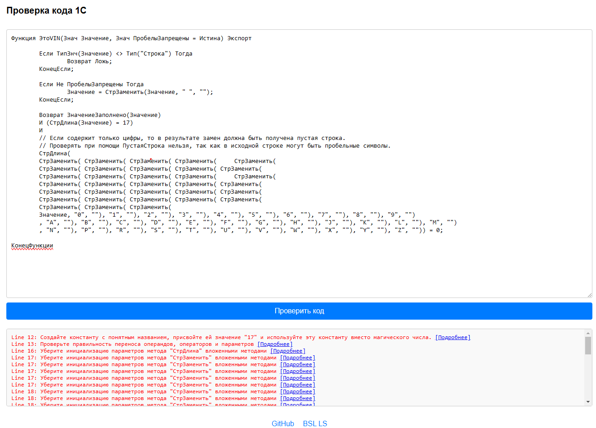

# Проверка кода 1С с использованием BSL Language Server

Этот проект предоставляет веб-интерфейс для проверки кода на языке 1С с использованием [BSL Language Server](https://github.com/1c-syntax/bsl-language-server).
Сервер анализирует код и возвращает список ошибок и предупреждений.

## Особенности

- Проверка кода на соответствие стандартам.
- Отображение ошибок с указанием строки и позиции.
- Ссылки на документацию для каждой ошибки.
- Простой и удобный веб-интерфейс.

## Внешний вид


## Запуск локально

Для запуска проекта локально выполните следующие шаги:

1. Установите [Python](https://www.python.org/downloads/) (версия 3.11 или выше).
2. Установите необходимые библиотеки:
```bash
pip install fastapi uvicorn
```
3. Установите JDK 17 [Java Development Kit](https://www.oracle.com/java/technologies/javase/jdk17-archive-downloads.html)
4. Склонируйте репозиторий:
```bash
 git clone https://github.com/SAShikutkin/bsl-checker.git
```
5. Скачайте JAR-файл BSL Language Server с [официального репозитория](https://github.com/1c-syntax/bsl-language-server/releases)
6. Переименуйте скачанный файл в  `bsl-language-server.jar` и поместите в корень проекта.
7. Запустите сервер:
```bash
 python server.py
```

После запуска сервера откройте браузер и перейдите по адресу [http://127.0.0.1:5000](http://127.0.0.1:5000).

## Развертывание из Docker

Для развертывания проекта с использованием Docker выполните следующие шаги:

1. Склонируйте репозиторий:
```bash
   git clone https://github.com/SAShikutkin/bsl-checker.git
   cd bsl-checker
```

2. Соберите образ:
```bash
   docker build -t bsl-checker .
```

3. Запустите контейнер:
```bash
   docker run -p 5000:5000 bsl-checker
```
  
После запуска контейнера откройте браузер и перейдите по адресу [http://127.0.0.1:5000](http://127.0.0.1:5000).

## Благодарности
- [1c-syntax/bsl-language-server](https://github.com/1c-syntax/bsl-language-server) — за отличный инструмент для анализа кода.

## Обратная связь
Если у вас есть вопросы или предложения, пожалуйста, свяжитесь со мной через 
- [GitHub Issues](https://github.com/SAShikutkin/bsl-checker/issues)
- [Телеграм](https:/t.me/SAShikutkin)

